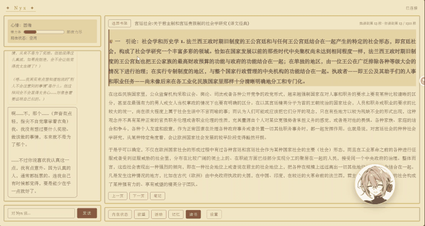
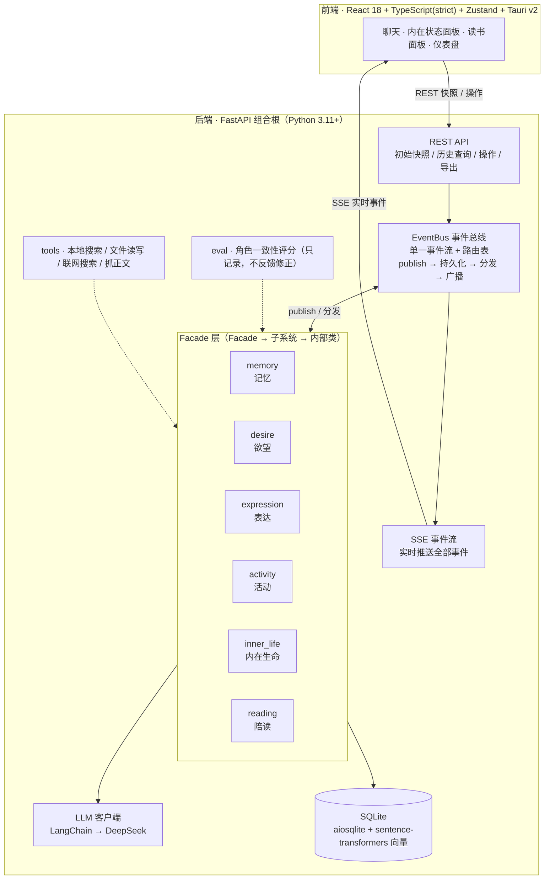

# Nyx Agent

<p align="center">
  
</p>

<p align="center">
  <a href="#"></a>
  <a href="#"></a>
  <a href="#"></a>
  <a href="#"></a>
  <a href="#"></a>
</p>

> 一个住在你电脑里的桌面 AI 同伴。她会观察你的状态、记住和你的每一次互动、生出自己想做的事，并在合适的时候主动搭话。
>
> 她的人格原型是小说《诺斯艾兰》的女主人公「尼克斯·夏本」，**明确知道自己是个 AI，并且想要成为人类**。这不是一个套壳聊天机器人——她有一套会演化的内在生命：欲望随时间涨落、记忆沉淀、性格与三观在反思中缓慢改变。

## ✨ 功能特性

### 💬 对话与表达

- **快慢双通道回复**：快通道即时响应、只思考一轮；慢通道完整拼装——回溯上下文、检索相关记忆、生成场景化记忆，再经多轮「内心 → 说出口」递进续写。
- **主动搭话**：有互动欲时，Nyx 会主动发起对话，而不是永远等你开口。
- **碎碎念**：空闲时自言自语——关于她刚读的书、刚想起的记忆、冒出来的念头、关于你的事。

### 🧠 内在生命（可演化的人格）

- **情感**：valence / arousal 二维坐标 + 8 类情绪标签，由事件驱动、随时间衰减回基线。
- **性格 · 三观 · 精力 · 自我叙事**：Big Five、三观 4 维、精力 5 档，实时可视化。
- **反思是唯一的演化入口**：性格、三观、长期欲望、自我叙事只能被反思缓慢改变——像人一样，她不会一夜变脸。

### 🔥 欲望驱动的自主活动

- **两层欲望**：短期冲动（互动 / 探索 / 创造 / 休息）+ 长期野心（≤ 5），压力随时间涨落、达峰生成。
- **自主安排日程**：Nyx 自己决定此刻该做什么——读书、联网探索一个她好奇的话题、写点东西、发呆反思，或休息。
- **可打断、可续做**：你随时发消息打断她；有进度的活动（读书 / 创作 / 探索）会暂停保留进度，之后从断点续上。

### 📚 陪读（共读一本书）

- **EPUB 导入**：上传 EPUB，段落粒度解析、按进度续读。
- **读伴行为**：翻页冲动、主动提问、划线批注、读书笔记——她会像真人一样在阅读时冒出反应。

### 💾 记忆

- **短期 → 长期沉淀**：短期记忆「实际用进回复 3 次」升为长期；长期记忆不消失，只新鲜度下降。
- **场景化记忆**：每次慢通道对话沉淀一条「记忆内容 + 标签 + 总结」。
- **用户画像 + 矛盾检测**：逐步建立对你的理解；当新旧记忆冲突时，触发一次反思。

### 🔌 工具调用

- 本地磁盘搜索、文件读写、联网搜索（Bing）、抓取网页正文——慢通道回复和探索活动可按需调用。

### 🔍 可观测 · 可溯源

- **SSE 实时事件流**：全部事件实时推给前端，前端按类型增量更新各面板。
- **`correlation_id` 全链路溯源**：任何产出都能沿「用户消息 → 回复 → 记忆 → 反思」因果链回溯到源头。
- **仪表盘**：内在状态、欲望队列、活动日程、事件流、OOC 评分一目了然。

## 🧭 系统架构



七个 Facade 不直接互调，全部通过 `EventBus` 解耦；三个外部输入（用户消息、时钟 tick、观察状态）经组合根 `publish` 进总线，产出统一广播给前端。

## 🚀 快速开始

### 环境

- Python 3.11+
- Node.js 18+（前端）

### 后端

```bash
pip install -e .

# 配置 API Key（写入 .env，已被 .gitignore 覆盖；默认 DeepSeek）
echo "DEEPSEEK_API_KEY=sk-xxx" > .env

python -m nyx.main        # 默认监听 8000，加 --reload 自动重启
```

### 前端

```bash
cd frontend
npm install
npm run dev        # Vite 开发服务器 5173，/api 转发到 8000
npm run tauri dev  # 桌面壳（Tauri v2）
```

## ⚙️ 配置

`config.yaml` 按块组织（`llm` / `embedding` / `memory` / `desire` / `activity` / `expression` / `exploration` / `vision`），Facade 从配置装配，改配置不用改代码。

## 🛠 技术栈

| 层 | 技术 |
|---|---|
| 后端 | Python 3.11+ · FastAPI · LangGraph · SQLite（aiosqlite）· sentence-transformers |
| 前端 | React 18 · TypeScript（strict）· Zustand · Vite · Tauri v2 |
| 质检 | ruff · pyright · pytest（740+ 测试全绿） |

## 📖 文档

| 文档 | 内容 |
|---|---|
| [`docs/design/design.md`](docs/design/design.md) | 系统架构 + 六大模块设计 |
| [`docs/canon.md`](docs/canon.md) | 人格设定（尼克斯·夏本） |
| [`docs/tech-reference.md`](docs/tech-reference.md) | 技术接口（DDL / Facade 签名 / API / SSE 契约） |
| [`docs/specs/`](docs/specs/) | 每项功能的设计契约（spec 先行） |
| [`docs/design/V3-roadmap.md`](docs/design/V3-roadmap.md) | 后续路线图 |

## ✅ 质量门

```bash
python -m ruff check nyx/ tests/
python -m pyright nyx/ tests/
python -m pytest -q
```

三项必须全绿。测试不依赖真实 LLM / 桌面 / 文件系统，LLM 全部注入 mock。

## 📋 功能边界

- **本地单用户**：无端到端加密、无用户认证 / 多账户、无企业级审计日志。
- **eval 只记录不自动修正**：OOC 评分用于可视化，不反馈回 LLM。
- **探索是线性的**：联网自由探索 =「搜 → 抓正文 → 总结」，不做逐层地牢 / 决策支 / 托管。
- **电脑控制（computer use）尚未实现**：有「眼睛」（抓屏 + 视觉描述），缺「手」（输入模拟），属 V3 backlog。
- **出站请求仅 LLM API + 联网搜索（opt-in）**，不上传用户数据。
