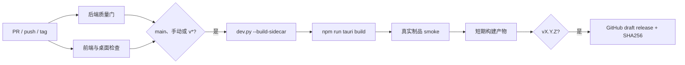

# CI/CD 设计

> 本文记录 Nyx Agent 已实现的持续集成与持续交付方案，不改变产品契约。
> 作品集层面的目标和排期见 [`portfolio-optimization.md`](portfolio-optimization.md)。

实现入口为 `.github/workflows/ci.yml`。2026-09-25 已在 Windows 本地完成锁文件安装校验、
全部质量门、sidecar/Tauri MSI 与 NSIS 构建以及冻结制品 smoke；GitHub 分支保护仍需在仓库设置中启用。

## 决策与边界

- **平台**：使用 GitHub Actions，与当前 GitHub origin 保持一致。
- **首发目标**：Windows x64；这是当前桌面启动器、presence 和安装包已经验证最多的平台。
- **主分支**：`main`；PR 和 `main` 使用同一组质量命令。
- **发布触发**：`vX.Y.Z` 标签；标签只能指向已通过质量门的 `main` commit。
- **CD 含义**：交付 GitHub Release 安装包，不部署远程服务。
- **密钥**：测试与 smoke 不调用真实 LLM；smoke 只注入固定非机密占位 key，不读取真实密钥。
- **公开发布**：第一阶段生成 draft release；代码签名与许可证确定后再自动公开。

## 复用现有入口

| 能力 | 现有入口 | 流水线用途 |
|---|---|---|
| Python 包与运行依赖 | `pyproject.toml` | 创建后端测试和 sidecar 构建环境 |
| 后端静态检查 | `python -m ruff check nyx/ tests/ scripts/` | PR 必过 |
| 后端类型检查 | `python -m pyright nyx/ tests/ scripts/` | PR 必过 |
| 后端测试 | `python -m pytest -q` | PR 必过；增加覆盖率参数而不改测试入口 |
| 前端依赖锁 | `frontend/package-lock.json` | `npm ci` 可复现安装 |
| 前端测试 | `npm test -- --run` | PR 必过 |
| TypeScript/Vite 构建 | `npm run build` | PR 必过 |
| Rust 依赖锁 | `frontend/src-tauri/Cargo.lock` | `cargo check --locked` |
| 冻结后端 | `python dev.py --build-sidecar` | 继续作为唯一 sidecar 构建入口 |
| 桌面安装包 | `npm run tauri build` | 继续使用 Tauri 配置和现有 bundle 路径 |
| 生命周期回归 | `tests/test_launcher.py`、Rust 壳测试 | 源码级防回归，与制品 smoke 互补 |

不新增 Makefile、任务执行器或第二套打包脚本。工作流只负责准备环境、调用这些入口、收集结果。

## 总体流程



当前只使用一个 `.github/workflows/ci.yml`，通过 job 条件覆盖三种事件，避免 CI 与 release
workflow 复制安装和构建逻辑。

## 触发规则

| 事件 | 后端质量门 | 前端/桌面检查 | 打包与 smoke | GitHub Release |
|---|---:|---:|---:|---:|
| Pull request | 是 | 是 | 否 | 否 |
| Push `main` | 是 | 是 | 是 | 否；产物保留 7 天 |
| `workflow_dispatch` | 是 | 是 | 是 | 否；用于发布预演 |
| Push `vX.Y.Z` | 是 | 是 | 是 | 是；创建 draft |

同一分支的新提交取消旧的 PR/main 运行；标签构建不得自动取消。这样既节省 runner，又不会产生
只有部分制品的 release。

## Job 设计

### 1. `backend-quality`

运行环境为 `windows-latest` + Python 3.11，匹配首发平台和项目最低 Python 版本。

目标命令：

```powershell
uv sync --locked --extra dev
uv run python -m ruff check nyx/ tests/ scripts/
uv run python -m pyright nyx/ tests/ scripts/
uv run python -m pytest -q --cov=nyx --cov-report=term-missing --cov-fail-under=90
```

现有 `pyproject.toml` 已增加 `dev` optional dependencies，并提交 `uv.lock`。`uv` 只承担
锁定和安装，不替换 setuptools 包定义，也不废弃 README 中现有的 `pip install -e .` 使用方式。
当前实测覆盖率为 91.71%，初始阈值定为 90%；提高阈值必须以关键路径收益为依据。

### 2. `frontend-desktop-quality`

运行环境为 `windows-latest` + Node.js 20 + stable Rust：

```powershell
cd frontend
npm ci
npm test -- --run
npm run build
cargo check --manifest-path src-tauri/Cargo.toml --locked
```

第一阶段不新增前端覆盖率硬门槛。现有 Vitest 没有覆盖率依赖，应先取得稳定基线，再决定阈值，
避免为了数字增加低价值断言。

### 3. `package-windows`

仅在两个质量 job 成功且事件为 `main`、手动或标签时运行：

```powershell
uv sync --locked --extra desktop-build
uv run python dev.py --build-sidecar
cd frontend
npm ci
npm run tauri build
```

复用 `dev.py` 中已有的模型下载、PyInstaller 排除项、资源打包和 Rust target 后缀处理；Tauri
继续从 `build/sidecar/nyx-backend` 取得 external binary。Hugging Face 模型缓存、npm 缓存、uv 缓存
和 Cargo 缓存使用锁文件作为 key，但缓存命中不能替代锁文件校验。

产物至少包括：

- `frontend/src-tauri/target/release/bundle/nsis/*.exe`；
- `frontend/src-tauri/target/release/bundle/msi/*.msi`；
- `SHA256SUMS.txt`；
- smoke 失败时的 `backend.log`。

### 4. `release-smoke`

源码内 API 测试不能证明冻结后的依赖、资源路径和进程生命周期正确，因此增加一个独立 smoke。
它不进入普通 pytest 收集，避免本地单元测试依赖已构建制品。

已实现的最小验收：

1. 断言 Tauri release 目录中 `nyx.exe` 与 `nyx-backend.exe` 同级；
2. 使用临时 `NYX_DB` 和固定非机密占位 key 启动冻结 sidecar，不读取真实 LLM Key；
3. 等待 `127.0.0.1:8000`，请求 `/api/state` 和 `/api/events/log` 并校验 JSON；
4. 连接 `/api/events`，至少校验成功响应与 `text/event-stream`；
5. 关闭 sidecar stdin 后确认进程退出、8000 端口释放；
6. 失败时保留 `artifacts/backend.log`，成功时删除日志和临时数据。

当前新增单个 `scripts/smoke_release.py`，不复制业务装配。冻结 sidecar smoke 是 release 阻断门；
Rust 生命周期测试与 Tauri build 覆盖桌面壳接线。交互式 WebView 桌面启动 smoke 在 Windows runner
连续稳定三次后再升级为阻断门，并保留失败证据，不静默跳过。

### 5. `release`

只在 `refs/tags/v*` 且 smoke 成功时运行。job 权限单独提升为 `contents: write`，其余 job 保持
`contents: read`。

- 校验标签版本与 `pyproject.toml`、`frontend/package.json`、`package-lock.json`、
  `src-tauri/Cargo.toml`、`Cargo.lock` 中 Nyx package、`tauri.conf.json` 一致；
- 不在 CI 中自动改版本或回写 commit；版本不一致直接失败；
- 根据 tag 和 commit 生成 draft release，上传 MSI、NSIS 和 SHA256；
- release notes 包含变更、验证结果、已知限制和“安装包尚未签名”等真实状态。

版本校验只需要一个小型 `scripts/check_release_version.py`。它读取结构化 TOML/JSON，不使用正则
改文件；`pyproject.toml` 是仓库内基准版本，release tag 是发布时的外部断言。

## 安全与权限

- CI 不读取开发机 `.env`，不上传 SQLite、workspace、日志中的用户内容或模型 Key。
- Fork PR 不获得 release 权限和任何签名密钥。
- 工作流默认 `contents: read`；只有 tag release job 使用 `contents: write`。
- 第三方 actions 在落地时固定到审核过的 commit SHA，并由 Dependabot 后续更新。
- 安装包签名证书属于第二阶段外部凭据；未配置前 release 保持 draft 并明确标注未签名。
- `npm audit`、`pip-audit`、`cargo audit` 先作为每周报告运行；建立处理基线后再升级为阻断门。

## 可观测性与保留策略

- 每个 job 保留清楚的阶段名称，失败命令直接返回非零，不用 `continue-on-error` 掩盖质量门。
- pytest 输出覆盖率摘要；前端保留 Vitest 失败输出；打包失败上传有限诊断日志。
- `main` 安装包保留 7 天，避免长期占用大量 artifact 存储；release 附件长期保留。
- 不在 README 手写“最近一次构建成功”；使用 workflow badge 链接到可审计运行。

## 实施状态

1. 已增加 `dev` optional dependencies、`uv.lock` 和可提交的 `.env.example`。
2. 已实现 `backend-quality` 与 `frontend-desktop-quality`；required checks 待仓库设置启用。
3. 已接入 `package-windows`，本地验证 MSI、NSIS 和制品路径。
4. 已实现版本检查与阻断式 `release-smoke`，本地真实冻结制品验证通过。
5. 已实现 `vX.Y.Z` draft release 路径；首次 tag 线上预演尚未执行。
6. 许可证、CSP 和代码签名仍属后续决策，未把 draft 流程升级为自动公开。

## 完成定义

- 干净 clone 可按锁定依赖完成全部质量门；
- PR、`main`、手动构建和 tag 的条件与权限符合本文；
- 质量命令与本地 README 一致，不存在仅 CI 可运行的隐藏入口；
- `main` 自动产生通过 smoke 的 Windows 安装包；
- 标签版本不一致、任一测试失败或 smoke 失败时不会创建 release；
- GitHub Release 可追溯到唯一 commit，并包含安装包、SHA256 和真实已知限制。
