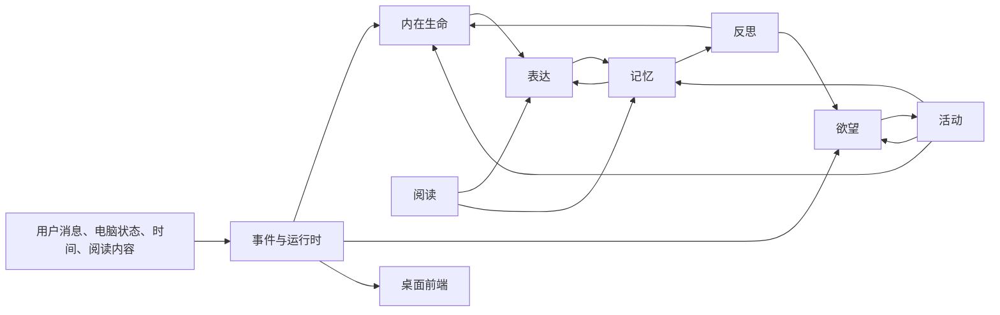
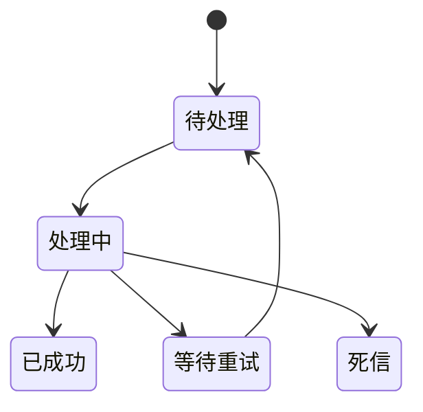
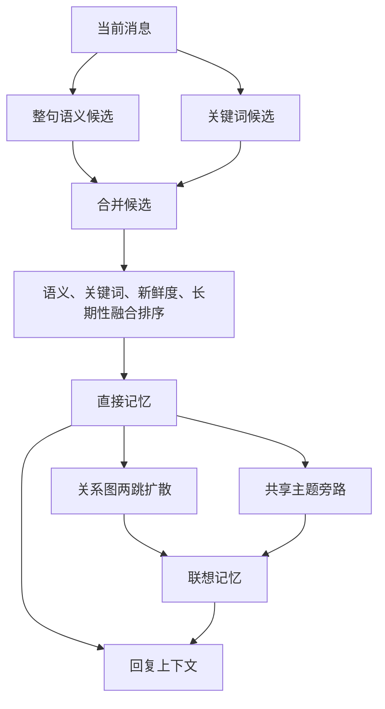
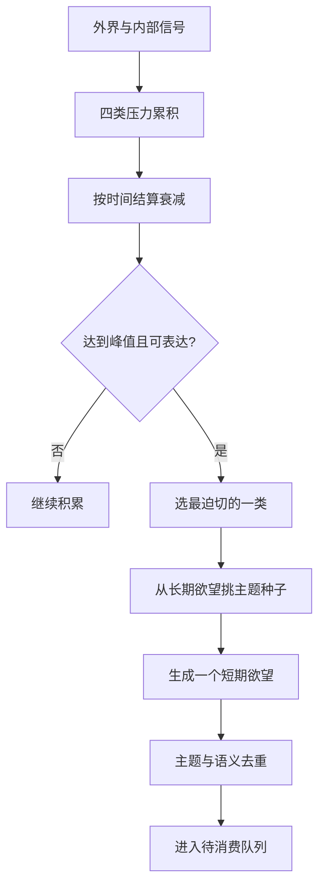
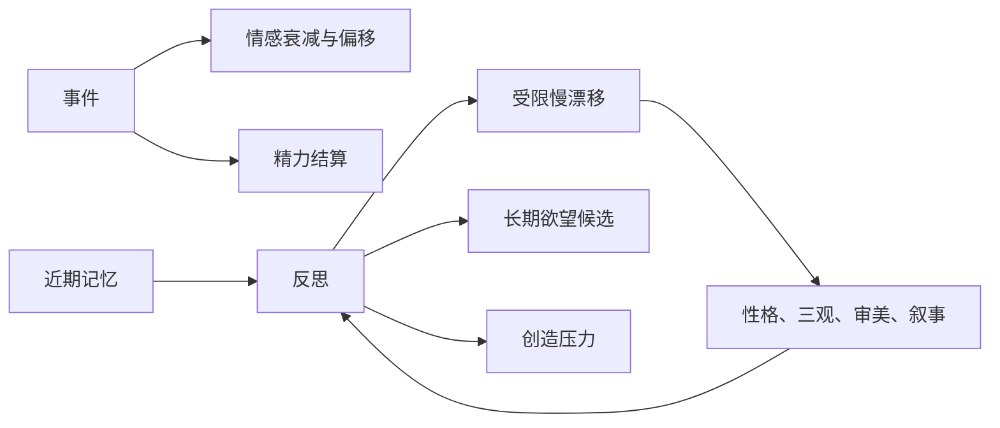
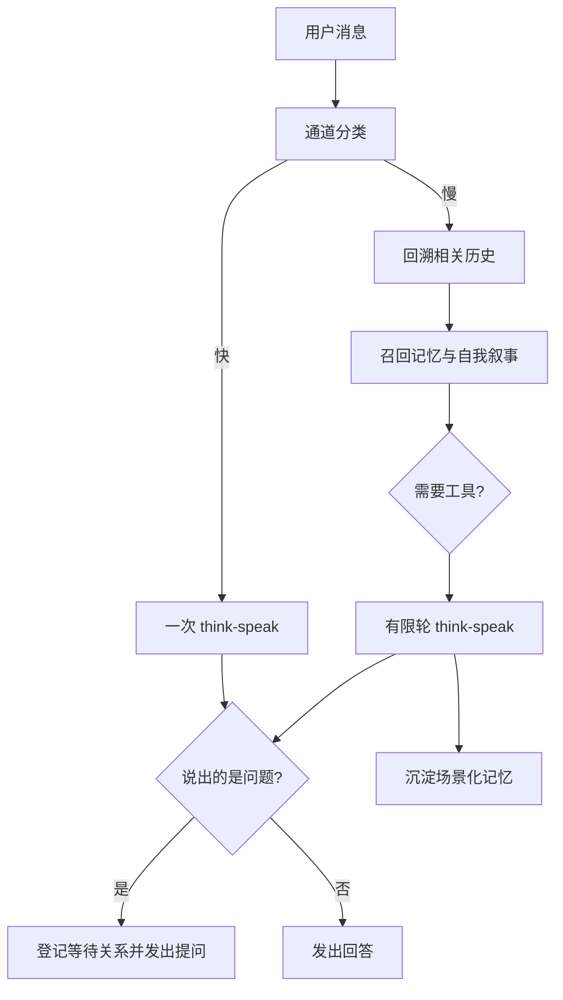
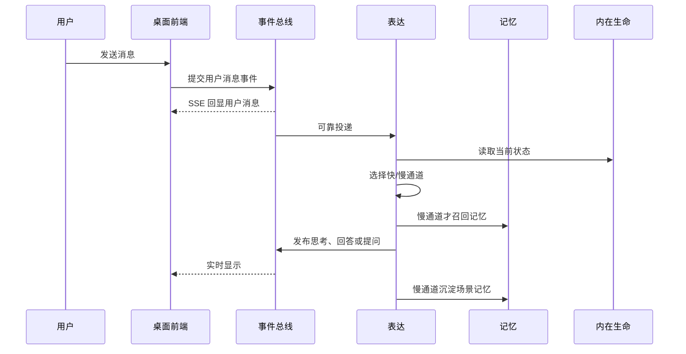
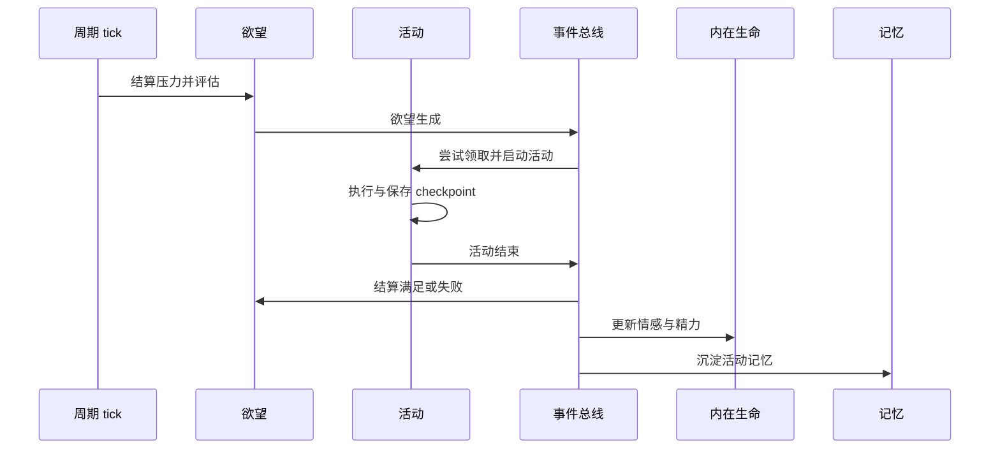
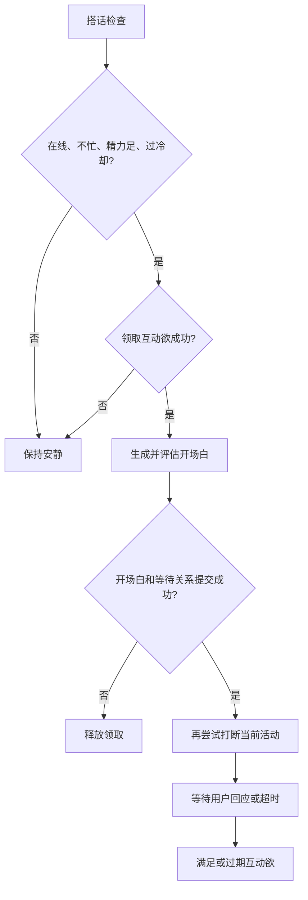
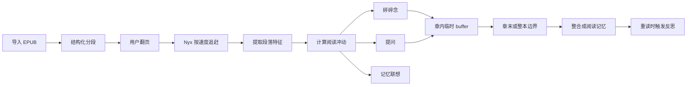

# Nyx Agent 功能设计备忘录

> 本文面向“想快速理解 Nyx 到底怎样运作”的读者，以产品语言解释已经实现的机制。
> 它不是接口、数据表、阈值或测试契约；若本文与 `docs/specs/`、`docs/facts/` 或源码不一致，
> 以对应领域的完整 spec 和当前源码为准。

## 1. 这是什么项目

Nyx Agent 是住在用户电脑里的桌面 AI 同伴。她不是一次问答结束后就归零的聊天窗口，
而是一个持续运行的状态系统：会记住经历、积累欲望、受情绪和精力影响、安排自己的活动、
在合适的时候主动说话，也会在长期互动中形成对自己的叙述。

项目同时追求两件事：

- 让陪伴感来自连续状态和主动行为，而不是只靠角色口吻；
- 让这些行为可追踪、可测试、失败后可恢复，而不是把一切藏在一次大模型调用里。

一句话心智模型：

> 外界事件改变内在状态，内在状态积累成欲望，欲望推动活动和表达，活动与表达又留下记忆，
> 记忆最终参与下一轮判断和反思。

## 2. 系统全景

### 2.1 九个部分

| 部分 | 回答的问题 |
|---|---|
| 事件与运行时 | 一件事怎样被可靠地交给多个系统处理？ |
| LLM、工具与评估 | 模型怎样被统一调用，怎样接触外部资料，怎样记账？ |
| 记忆 | 哪些经历留下来，聊天时怎样想起它们？ |
| 欲望 | Nyx 为什么会想做某件事，这种冲动怎样消退或强化？ |
| 内在生命 | 情绪、精力、性格、三观、审美和自我叙事怎样变化？ |
| 活动 | 欲望怎样变成读书、创作、探索、观察或休息？ |
| 表达 | 用户消息怎样变成思考、回答、提问、搭话或碎碎念？ |
| 阅读 | 用户与 Nyx 怎样在同一本书中异步共读并产生互动？ |
| 桌面前端 | 后端状态怎样成为用户能看到、能操作的陪伴界面？ |

### 2.2 总体循环

这里没有一个“万能大脑”直接控制全部系统。每个领域只维护自己的事实；跨领域变化由事件
连接。状态读取可以直接发生，例如表达读取当前情绪，但跨系统写入必须留下可追踪的事件。

# 各部分实现

## 事件与运行时

事件总线是系统的因果骨架。用户发消息、欲望生成、活动结束、反思开始等事情都会先成为
事件。每个事件都有唯一标识和 `correlation_id`，后者把“用户这句话 → Nyx 回复 → 新记忆
→ 后续反思”串成同一条因果链。

系统区分两个事实：

1. 事件已被接受并持久化，说明“这件事发生了”。
2. 某个消费者处理成功，说明“这个模块已经完成了自己的副作用”。

两者不能混为一谈。活动结束事件落库，并不自动代表欲望、内在生命和记忆三个消费者都已
完成更新。

事件采用“本地原子提交 + 跨模块最终一致”的模型。一个领域内部的状态和它产生的后续事件
一起提交；领域之间不假装拥有一个能回滚大模型调用、文件写入和界面广播的全局事务。

同一消费者内部按顺序处理，不同消费者可以独立推进。失败会退避重试；进程中途退出后，
过期的处理中任务会在下次启动时重新领取。因为投递是“至少一次”，消费者必须能识别同一个
事件是否已经生效，避免重复扣精力、重复满足欲望或重复生成内容。

运行时还负责周期性 tick。不同 tick 分别检查日程块、欲望评估、碎碎念、主动搭话和反思，
而不是由一个巨大的定时任务混合处理。内存队列只是唤醒提示，持久化事件才是事实来源。

关停时，系统先停止接收新写入，再等待已经接受的事件和后台任务排空；来不及完成的投递保留
到下次启动恢复。这样“关闭窗口”不会被伪装成一次成功的全局回滚。

## LLM、工具与评估

所有文本模型调用走同一个客户端。它统一处理模型供应商、模型名、密钥来源、超时、重试、
结构化输出、工具描述、调用标识和 token 用量。业务系统只说明“这次要做什么”，不各自直接
连接模型服务。

视觉理解单独处理，因为图像消息和纯文本消息的输入形态不同，但仍遵守相同的配置、密钥和
可测试原则。

工具系统提供四类能力：

- 搜索本地文本资料；
- 按开关启用联网搜索；
- 读取、列出或在受限工作区写文件；
- 抓取网页正文，供探索过程消化。

工具本身只返回结构化结果，不决定 Nyx 应该做什么。活动或表达系统先判断是否需要工具，
再把结果作为材料交给模型。联网能力是显式启用的；工具失败时允许降级，但不能伪造查询结果。

每次模型产出都会经过评估旁路。评估记录输出属于哪个模块、哪种产出、是否偏离角色、使用了
多少 token。一次模型调用拆成“思考”和“说话”两条评估记录时，共享同一个调用标识，统计
token 时只算一次。评估失败不能拖垮主流程，也不会自动改写模型输出，它的职责是可观测，
不是在线训练。

## 记忆系统

### 记忆的种类

记忆按来源分为经历、用户画像、知识、阅读、活动和互动。来源决定它的生命周期和用途；
主题只是最多几个受控标签，用来辅助联想，不承担权限或类型判断。

记忆还分短期与长期。短期记忆被真实用于慢通道回复达到一定次数后才升为长期记忆。
“搜到了”不算使用，只有确实进入回复上下文才计一次召回。

### 写入与去重

写入先做同类精确去重，再做同类语义去重。精确去重忽略无意义的空白和标点差异；语义去重
从有界向量候选里找最相似项。经历类记忆更谨慎：即使文本很相似，发生时间相隔较远也会
保留成两个独立经历。

语义相似并不等于事实相同。否定极性、数字或明确时间不同会阻止合并，避免把“喜欢”和
“不喜欢”、昨天和今天的事件压成一条。命中旧记忆时只强化旧项的新鲜度和召回次数；只有
真正的新记忆才会建关系、检查矛盾、衰减淘汰并广播创建事件。

### 召回

记忆召回不是单一路径，而是“直接召回 + 联想扩散”：

整句语义负责“意思相近但措辞不同”，关键词负责专名、数字和明确短语。排序以语义相关性为主，
关键词命中次之，再用新鲜度和长期记忆身份做小幅修正。直接命中确定后，系统沿记忆关系图最多
扩散两跳，并从共享主题中有限补充，得到“这件事让我想起另一件事”的效果。

### 记忆关系图

新记忆会尝试建立多种关系：语义相似、共享实体、共享关键词、时间接近，以及模型判断出的
同主题、补充、对照、因果、偏好更新和用户画像关联。图是无向联想图，不表达事实方向。

每类边和总边数都有上限，弱的、旧的、只因时间靠近的关系更容易被剪掉。这样可避免某个热门
主题变成连接所有记忆的超级节点。图可做社区聚类，用于分析记忆簇，但聚类结果不落库，也不
直接改变聊天排序。

### 场景化记忆

只有慢通道回复结束后才生成场景化记忆。模型把本轮上下文压成内容、类型、主题和摘要，再走
与其他记忆相同的去重、建边和生命周期流程。快通道不生成场景化记忆，避免每句闲聊都产生
大量低价值记录。

## 欲望系统

欲望不是直接从一句 prompt 临时编出来的，而是先积累压力。当前有互动、探索、创造和休息
四类压力，每类都维护：当前压力、表达权重和抑制阈值。

- 当前压力表示“有多想做”；会受观察、长期目标、疲惫、读书、探索和反思影响，并随时间衰减。
- 表达权重表示这类欲望过去是否常被成功满足；满足会强化它，也参与活动选择排序。
- 抑制阈值表示失败后的谨慎程度；多次失败会提高门槛，避免不断提出做不到的事。

周期评估先结算衰减和新的压力，只从达到峰值且越过抑制门槛的类型中选最迫切的一种。每轮最多
生成一个短期欲望，其他已达峰类型保留压力，留到下一轮。

长期欲望提供主题池。系统优先选择尚未做过的主题；都做过时选记忆新鲜度最低的主题，避免总在
同一处打转。主题锚点也用于短期欲望去重；没有可靠主题时，再比较描述的语义相似度。

短期欲望会经历待处理、已领取、满足、抑制和过期。活动或主动搭话必须先原子领取，保证并发
检查不会消费同一条欲望两次。目标可以要求累计完成多次；只有达到计数才算真正满足。

满足会强化表达权重，并推进最相关的长期欲望。失败会增加重试次数；超过上限后欲望过期，
一部分压力退回，同时提高抑制阈值。被打断的欲望进入可恢复的抑制态，当同类压力再次足够时
可回到待处理队列。

## 内在生命

内在生命分为快变量和慢变量。

快变量包括情感与精力。情感使用效价和唤醒度二维坐标：效价表示正负感受，唤醒度表示激活
程度。事件先让旧情感向中性基线衰减，再叠加本次事件的偏移。二维数值映射为开心、害羞、
悲伤、担忧、愤怒或中性；极低精力优先显示困倦，反思或探索活动优先显示思考。

精力位于有限区间，活动消耗或恢复精力，空闲时间也会惰性恢复。所谓“惰性”是指不需要后台
每秒写数据库，而是在读取状态或处理事件时，按经过的时间一次结算。

慢变量包括 Big Five 性格、三观、审美和自我叙事。它们不会被普通消息直接改写，反思是唯一
演化入口。反思读取近期记忆、现有慢变量、叙事和长期欲望，一次生成本轮反思计划，然后以
受限幅度更新：

- 性格、三观和审美每次只能小幅漂移，不能一夜变成另一个人；
- 自我故事和“想成为什么”追加新片段，自我看法按键合并，核心身份保持不变；
- 可以提出新的长期欲望候选，但仍受容量和语义去重约束；
- 反思成功会增加创造压力，让“想明白了”有机会变成“想表达出来”。

审美变化还受新增阅读记忆数量调节：没有新的阅读经验时不应凭空发生大幅审美漂移。

## 活动系统

活动系统把“想做”变成“正在做”。可执行活动包括自己读书、创作、自由探索、观察用户、
空闲反思和休息。互动欲不进入日程，它由主动搭话即时消费。

每个日程块开始或新欲望生成时，系统都会尝试启动活动。已有活动时不重复启动。选择规则先看
精力，再按欲望类型的表达权重排序；同权重时先来的先处理。精力过低会优先休息。没有可执行
欲望时，低精力做空闲反思，否则观察用户。

欲望到活动的主映射是：探索欲优先读本地材料，创造欲触发创作，休息欲触发休息。探索欲在
没有合适材料、有明确主题且通过限速时，才升级为自由探索。

活动先持久化为待启动，再由后台任务执行，避免长时间模型调用、文件读取或网页抓取阻塞事件
总线。真正开始后进入运行态，结束时成为完成或未完成；被打断时，可续活动暂停，不可续活动
放弃。

可续活动通过 checkpoint 记录安全点：

- 自己读书记录读到哪里、片段笔记是否写入、整书总结是否完成；
- 创作记录风格、模型产出和文件写入是否完成；
- 自由探索记录搜索、逐条阅读、总结和沉淀分别推进到哪一步。

恢复时复用同一活动和已保存产物，跳过已经完成的不可逆步骤。重启后，尚未真正启动的活动会
放弃并释放资源；已运行的可续活动暂停，等待合适的日程块恢复。

活动结束会携带三类结果：产出本身、精力变化、目标是否达成。目标结果为“未知”时表示本次
有进展但还不能结算欲望，例如读完一块但没有读完整本；它既不是成功也不是失败。

## 表达系统

表达系统负责五种对用户可见的行为：普通回复、提问、主动搭话、全局碎碎念和阅读中的主动
反应。核心设计是快慢通道，而不是所有消息都走同样昂贵的流程。

### 快慢通道

通道分类综合消息长度、问句特征、情绪词、Nyx 当前精力和唤醒度、距离上次慢思考的时间。

快通道只进行一轮 think-speak 生成，不检索记忆、不调用工具、不生成场景化记忆。它适合简短
确认、轻松闲聊和即时回应。

慢通道会回溯相关对话、检索并记录真正用到的记忆、读取自我叙事、判断是否需要工具，再进行
有限轮续写。它适合复杂问题、情绪内容、需要回忆的对话和一段时间未深入思考后的消息。

### think-speak

think-speak 不是先调用一次“思考模型”、再调用一次“说话模型”。每一轮模型调用同时返回内部
思考与对外说话两个字段。系统分别评估、分别发布：思考用于展示推理过程或调试语境，说话才是
用户收到的正式内容。慢通道下一轮会看到前面累积的思考和发言，从而继续，而不是从头生成。

结构化输出非法、说话为空、模型或评估失败时，会尝试一次带明确格式约束的重试。仍失败则发出
固定降级回复。降级回复不伪造思考、不创建提问等待、不生成正常场景记忆。

### 对话历史与回溯

历史有容量上限。快通道读取最近历史；慢通道从新到旧回溯，遇到时间间隔过大、内容关联断开
或长度预算耗尽时停止。快通道的 Nyx 消息会被慢通道回溯跳过，以减少轻量回应对深层语境的
干扰，但回溯仍会继续寻找更早的相关内容。

### 提问、搭话与碎碎念

提问会创建一条可持久恢复的等待关系。用户回复时优先按明确引用匹配，否则只领取最新的一条
等待项；超时后进入过期状态。主动搭话的回答还会结算对应互动欲。

主动搭话必须先确认用户在线状态、忙碌程度、精力和冷却，再原子领取一条互动欲。开场白和等待
关系成功提交后，才允许打断当前活动。这样生成失败时不会留下“活动被打断，但 Nyx 什么也没
说”的状态。

碎碎念是更轻的即时行为：只有当前没有活动且概率命中时才尝试。一部分由模型即兴生成，其余
从活动、记忆、欲望、用户四类模板中挑选。没有材料、内容为空或近期重复时保持安静。模型失败
会退回模板。碎碎念不进入对话历史，在界面上以头像旁短暂气泡出现。

## 阅读系统

阅读系统服务于“用户与 Nyx 共读”，和 Nyx 自己执行的读书活动是两套并行机制。

用户导入 EPUB 后，系统按正文结构切成从 1 开始编号的段落，并识别章节开头。标题会和紧邻
正文合并，连续列表会合并，过短段落会适度拼接，过长段落会按句子拆开。整本分段正文的内容
摘要用于防止重复导入。

用户和 Nyx 各自有阅读位置。用户翻页后，Nyx 按设定阅读速度逐段追赶，永远不会超过用户。
进度使用单调版本号做条件写入；多个异步保存发生冲突时，前端先读取最新版本再重试，避免旧
页面覆盖新进度。

### 阅读冲动

每个新段落先提取感叹、疑问、哲思、感官、正负情绪、人物提及和文本丰富度等特征，再与当前
精力、探索压力、互动压力和亲和性组合成六类即时驱动。驱动通过加权组合形成五种行为倾向，
只有越过各自阈值且不在冷却期的行为才触发。

触发后的行为包括碎碎念、提问和记忆联想。提问必须确实是合法问句；引用式提问还必须包含
所引用文本。联想从记忆系统取最多少量相关片段。提问和联想会进入对话上下文，因此用户可以
自然接话；阅读碎碎念只显示为短暂气泡。

### 章末整合

Nyx 的阅读碎碎念和提问先进入每本书的临时 buffer，不逐条写成长期记忆。到章末或整本结束
时，系统截取一个快照，用一次模型调用把零散反应整合成阅读记忆。记忆成功写入后，重读还会
触发反思；所有必要步骤成功后才删除快照。整合期间新产生的内容保留到下一轮，不会被误删。

整本读完的事实先独立提交，因此记忆整合失败不会让“读完次数”倒退。空 buffer 也不妨碍
完成计数。用户笔记与 Nyx 的阅读记忆严格分离；用户可以把某条笔记单独给 Nyx 看并得到批注。

## 桌面前端

前端运行在桌面壳的 WebView 中，Python 核心是独立本地服务。两者通过 localhost 通信：

- REST 负责初始快照、用户动作、历史和导出；
- SSE 负责实时事件。

前端不复制后端业务规则。每个领域有自己的状态容器：聊天按事件追加，内在状态先取全量快照
再用情绪事件局部更新，欲望和活动收到事件后重新拉取权威快照，阅读状态单独维护书架、进度、
追赶和笔记。

发送消息时前端不乐观插入一条本地消息，而是等待同一条用户事件经 SSE 回显，从源头避免
“本地消息 + 服务端消息”的去重问题。回复按 `correlation_id` 匹配，主动搭话不会误结束另
一条用户消息的等待动画。

界面布局把对话固定在左侧，阅读与内在、欲望、活动、记忆面板位于主区。碎碎念、阅读碎碎念
和反思摘要共享头像上方的短暂气泡；读书提问和记忆联想进入常驻对话。SSE 重连后会重新拉取
快照，以修复断线期间可能漏掉的临时帧。

# 四条端到端流程

## 用户发来一条消息

## Nyx 自己产生并完成一件事

## Nyx 主动搭话

## 用户和 Nyx 共读

# 答疑

## 记忆系统

### 1. 记忆召回是怎么做的？

先把整句转换成语义向量，从近似索引中取得一批候选；再从原句提取中英文关键词，补充专名、
数字和明确短语命中的候选。两路候选合并后，以语义为主、关键词为辅，再参考新鲜度与短期/
长期身份排序。取出的直接记忆会作为种子，在关系图中扩散最多两跳，并用共享主题补少量联想。
最终直接记忆在前，联想记忆在后，数量都有明确预算。

### 2. 项目真的用了“向量库”吗？

没有独立部署外部向量数据库。记忆向量随记忆保存在本地 SQLite 中，运行时构建确定性的内存
近似最近邻索引。当前桌面单用户规模下，这样能减少基础设施，同时保留语义召回能力。

### 3. 向量能力都用在哪里？

- 聊天慢通道的语义候选召回；
- 新记忆同类语义去重；
- 为记忆建边和矛盾检测缩小候选范围；
- 短期欲望描述与长期欲望名称的语义去重；
- 评估语音型输出是否偏离角色。

关键词检索、主题联想、时间关系和图扩散都不是向量能力，向量失效时这些路径仍可工作。

### 4. 为什么不直接把最相似的几条记忆塞进 prompt？

纯相似度容易漏掉专名和数字，也容易得到一组彼此重复的表面相似句。混合召回先提高精确性，
再用关系图补充因果、对照、用户偏好等非纯文本相似关系，更接近人类的“由此想到彼”。

### 5. 短期记忆怎样变长期？

只有在慢通道中真正进入回复上下文才增加一次召回计数。达到阈值后升级长期。重复写入导致的
强化不会冒充一次真实回忆，也不会直接触发升级。

### 6. 会不会把相反事实合并？

系统在语义去重前检查否定、数字和明确时间锚点。发现冲突时宁可保留两条，也不把它们误合并。
新记忆落库后还会对少量高相似候选做矛盾判断，矛盾可成为反思材料，但这个旁路失败不会撤销
已保存的记忆。

## 欲望系统

### 1. 欲望是随机生成的吗？

不是。随机性只来自模型如何表述具体欲望；是否有资格生成，先由可解释的压力、衰减、峰值和
抑制门槛决定。每次评估只生成当前最迫切的一种。

### 2. 短期欲望和长期欲望有什么区别？

短期欲望是准备被活动或表达消费的具体冲动，有状态、目标和重试过程。长期欲望是较稳定的方向，
为短期欲望提供主题种子和进度归属。长期欲望主要来自反思或探索沉淀，不直接占用活动槽。

### 3. 为什么失败后既返还压力又提高抑制？

返还压力表示需要没有消失；提高抑制表示系统对再次表达更谨慎。两者并存，才能避免失败一次就
永远放弃，也避免在条件不合适时机械重复。

### 4. 为什么互动欲不进入日程？

搭话是跨活动的即时行为。若把它放进一小时活动格，用户可能要等到当前活动结束才收到回应，
也无法表达“突然想和你说句话”的感觉。因此它走独立的领取、承诺、打断和等待流程。

### 5. 同一个欲望会被重复消费吗？

正常路径不会。活动和主动搭话都要先原子领取；只有一个并发调用方能把待处理状态改成已领取。
失败或超时按规则释放、抑制或过期，而不是留在一个无人能处理的中间态。

## 内在生命

### 1. 情绪是让 LLM 自己说“我现在很开心”吗？

不是。情绪先由事件和时间作用在二维数值上，再由确定性分区映射为标签。LLM 只读取这个状态
并据此调整表达，不能随意改写底层情绪值。

### 2. 为什么情感不持久化，性格却持久化？

情感是短时状态，重启后回到中性可以接受；性格、三观、审美和叙事代表长期连续性，必须跨重启
保留。精力虽然变化较快，但影响活动安排，也需要持久化。

### 3. sleepy 和 thinking 为什么优先于普通情绪？

它们描述的是更直接的可见状态。极度疲惫时，即使效价偏正，表现仍应首先是困倦；处于反思或
探索时，思考状态比二维情绪标签更能解释当下行为。

### 4. 反思具体改变什么？

反思可小幅调整性格、三观和审美，追加自我故事与未来倾向，提出长期欲望候选，并提高创造压力。
核心身份不被覆盖，单轮漂移有上限，候选欲望还要经过容量和去重检查。

### 5. 为什么反思失败要重试，而普通评估失败可以跳过？

反思是慢变量的唯一写入口，丢掉一次已被可靠触发的反思会造成不可恢复的状态缺口；评估只是
观测旁路，主行为不依赖它成功。因此两者的失败语义不同。

## 活动系统

### 1. 日程是预先排好一整天的吗？

不是。系统按固定时间网格形成日程块，在块开始或新欲望出现时做一次当前决策。日程表展示的是
今天实际产生的活动记录，而不是提前生成的不可更改计划。

### 2. 没有欲望时 Nyx 会做什么？

精力较低时进行空闲反思，精力足够时观察用户状态。它们是不占用欲望的默认活动。

### 3. 什么活动可以恢复？

自己读书、创作和自由探索可以恢复，因为它们有明确 checkpoint。观察、休息等瞬时活动被打断
后直接放弃。恢复只优先发生在同一日程块，避免隔很久后突然续上失去语境的工作。

### 4. 自由探索和读书是什么关系？

探索欲先尝试消费本地材料。只有没有合适材料、目标主题明确且通过限速时，才升级到自由探索。
自由探索会搜索、读取少量结果、总结发现，并把知识或长期方向沉淀回来。

### 5. 为什么活动完成不一定满足欲望？

活动完成表示这次执行顺利结束，欲望满足表示目标真的达成。读完一段但没读完整本属于“有进展，
暂不结算”；创作缺标题或正文则属于目标未达成。分开二者可避免把任何正常退出都当作满足。

## 表达系统

### 1. 碎碎念在哪里？

后端由独立的碎碎念周期检查触发，只在没有当前活动且概率命中时尝试。产出可能来自模型，也
可能来自活动、记忆、欲望或用户相关模板。前端不把它放进聊天历史，而是在可拖拽头像上方显示
几秒后淡出的气泡。阅读碎碎念和反思摘要也复用这条临时气泡展示路径。

### 2. think-speak 具体是怎么实现的？

每一轮只调用一次模型，要求同时给出内部 think 和对外 speak。两部分分别评估、分别成为事件；
慢通道可以把前几轮累积结果带入下一轮继续思考。它不是两个模型互相对话，也不是先无限思考
再输出。任何一轮出现问句会登记等待关系并结束本次回复。

### 3. 快通道会不会完全没有思考？

不会。快通道仍可产出一次 think 和 speak，只是跳过记忆、工具、场景记忆和多轮续写。它节省的
是上下文装配和额外步骤，不是把输出退化成固定模板。

### 4. 为什么慢通道不把全部聊天历史都塞进去？

无限历史会引入无关内容、增加 token，并让早期话题干扰当前语境。回溯按容量、时间连续性和
内容关联性停止，相当于寻找当前话题的局部上下文。

### 5. 主动搭话和碎碎念有什么区别？

主动搭话消费互动欲，可能打断活动，会创建等待用户回答的持久关系，回答或超时后还要结算欲望。
碎碎念不消费互动欲、不等待回答、不进入历史，也不打断活动，是更轻的环境性表达。

### 6. LLM 输出坏了会怎样？

先进行一次格式重试；仍失败就发固定降级回复。降级路径不发布伪造思考、不创建问题、不写正常
场景记忆。若连降级事件也未能可靠提交，本次消息会由事件投递机制重试。

## 阅读系统

### 1. Nyx 是和用户同步读吗？

不是严格同步。用户位置和 Nyx 位置分开保存。用户可以快速翻页，Nyx 按字符数和阅读速度逐段
追赶；追上后进入等待，绝不会读到用户尚未到达的段落。

### 2. 阅读冲动是不是每段都问一次 LLM？

不是。先用本地可测试的特征和加权规则决定是否触发行为，只有真正需要生成碎碎念或问题时才
调用模型。记忆联想直接复用记忆检索。

### 3. 为什么阅读反应先放 buffer？

逐条把碎碎念写成记忆会产生大量噪声。章末整合能把一段时间内的反应压成更稳定的阅读体验，
同时保留原始互动的即时感。

### 4. 阅读提问为什么既出现在阅读事件里，又出现在统一 ASK 里？

统一 ASK 负责“系统正在等用户回答”的语义，阅读事件负责书籍、段落、引用和提问子类型等展示
信息。两者共享同一等待关系，并在正式路径中一起提交，避免界面显示了问题却无法接住回答。

### 5. 用户笔记会自动变成 Nyx 的记忆吗？

不会。用户笔记是用户自己的内容；只有用户明确选择“给 Nyx 看”时才生成批注。Nyx 的阅读
记忆来自章末或整本整合，两条数据路径相互独立。

## 事件与可靠性

### 1. 为什么事件已经在日志里，界面或状态仍可能没更新？

事件日志只证明事件已被接受。每个消费者还有独立投递状态，可能正在处理、等待重试或已经进入
死信。界面 SSE 也只是广播通道，不能作为业务完成证明。

### 2. 为什么系统允许同一事件被处理多次？

进程可能在业务提交后、投递标记成功前崩溃。为了不丢事件，下次启动必须重放；因此业务处理要
通过事件标识识别已经提交的效果。相比“最多一次但可能丢”，这里选择“至少一次并要求幂等”。

### 3. SSE 断线会丢状态吗？

可能漏掉临时展示帧，但不会把 SSE 当成权威业务存储。重连后前端重拉状态快照；持久化事件和
业务状态仍在本地数据库中。

### 4. 为什么不用跨所有模块的大事务？

大模型请求、网页抓取、文件写入和已经广播的 SSE 都无法靠 SQLite 回滚。强行宣称全局事务只会
制造错误安全感。系统把可回滚的本地事实原子提交，再用持久化投递和幂等恢复跨模块一致性。

## 前端与数据

### 1. 哪些数据保存在本地？

对话事件、记忆、欲望、活动、慢变量、阅读书库与进度、笔记和评估记录都保存在本地 SQLite
或本地工作区。模型密钥来自环境变量，不写进仓库。

### 2. 为什么有些面板收到事件后还要重新请求？

欲望和活动事件通常只携带发生了什么以及对象标识，不复制整个对象。重新拉取权威快照可以避免
前端自行重演后端状态机。高频且字段很少的情绪更新则直接局部覆盖。

### 3. 为什么聊天发送后不立即本地显示？

消息要先被后端可靠接受。前端等待同一事件经 SSE 回显，通常只有 localhost 的极短延迟，却能
避免乐观消息与服务端消息的去重、替换和追溯分歧。

# 当前边界与有意取舍

- 当前是单用户、本地桌面应用，不提供账号、远程多租户或端到端加密。
- 没有独立外部向量数据库；当前规模使用 SQLite 持久化向量和内存近似索引。
- 情感保存在进程内，重启回到中性；慢变量、精力和业务状态持久化。
- 工具与矛盾检测等旁路允许失败降级；反思、活动结算等核心状态变化必须可靠重试。
- 阅读系统的用户共读书库与 Nyx 自己的活动材料库并行存在，目前不自动互相转换。
- 长期欲望的强度会变化，但当前还没有完整接入排序、prompt 或活动决策；后续方向见路线图。
- 电脑控制目前只有观察能力，没有开放输入模拟闭环。

# 文档阅读地图

本文负责解释“为什么和怎样运作”，不定义可执行契约：

| 想了解的内容 | 阅读入口 |
|---|---|
| 当前功能的理论全景 | 本文 |
| 未实现方向 | `docs/design/V3-roadmap.md` |
| 每个领域的签名、状态、阈值和事务语义 | `docs/specs/` 对应完整 spec |
| 当前源码已经做到什么 | `docs/facts/` 对应事实摘要 |
| 源码与测试从哪里找 | `docs/tech-reference.md`、`docs/test-inventory.md` |
| Nyx 的人格与静态设定 | `docs/canon.md` |

维护本文时只描述已实现且已被 spec 定义的行为。新增功能先更新对应完整 spec；实现完成后再把
新的心智模型补进本文。若要改变本文背后的既有语义，必须先修改并确认对应领域契约。
